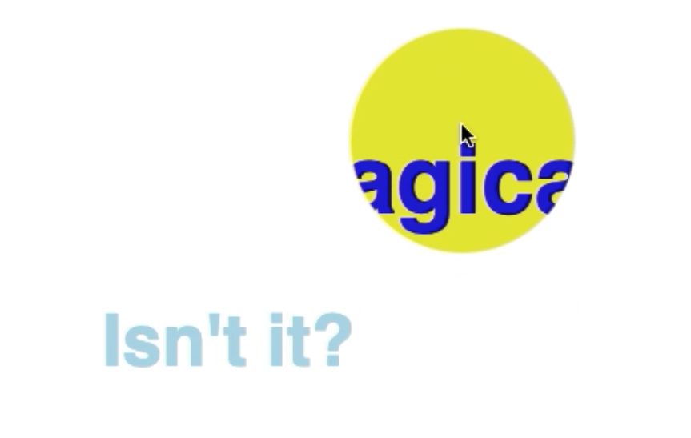

import { CodepenEmbed } from '../../src/components/codepen';

## The custom cursor

If you scroll through the Awwwards website, you’ll see them very often. Animated cursors. Sometimes its a cirkel beneath your cursor, sometimes it completely replaces your cursor. Some cursors animate on click, some animate on hover.
When thought out right, it can add a lot to your brand. But… How do you build one?

There are a few ways how you can build animated cursors. By using a canvas element, or just by using div’s.
To keep this short tutorial as easy as possible, we’ll be using div’s.



### Let's get started

First we'll be adding one or multiple div elements (in the example below I added one div. It’s called “.cursorWrapper”). In CSS you’ll give this element a fixed position, a top and a left with the value “0” and a transform that takes two css-variables. That will later be the “x” and a “y” coordinates of your mouse.

Your CSS should now look like this.

```css
:root {
	--posX: 0px
	--posY: 0px
}

.cursorWrapper {
    /* We're using translate3d for optimal performance */
	transform: translate3d(var(--posX), var(--posY), 0);
	position: fixed;
	top: 0;
	left: 0;
	pointer-events: none;
}
```

Now you have your base. You still don’t see anything. The actual visuals, we put in a `::before` pseudo-element. We’re doing this, because if we want to animate the scale asynchronously from the position we’d rather have them in separate selector.

Now we want to create the cursor itself. Let’s create a before pseudo-element. This element wil be the visible cursor. Don’t forget that `::before` needs a “content” property and “position: absolute”.

In terms of styling you can do what you want. Make sure you add a width and height. And also disable pointer-events in your CSS. We do this, so you’re able to click through the custom cursor. We add this code to our CSS file:

```css
.cursorWrapper::before {
  position: absolute;
  width: 50px;
  height: 50px;
  pointer-events: none;

  background-color: purple;
  border-radius: 25px;
}
```

Add any other styling you want. You can for instance use clip-path to make your cursor get different shapes.

## Adding the mouse movement

So right now, we have all the styling of the cursor, but it still doesn’t work. So we’ll be adding a layer of JavaScript right now. We’ll start bij adding a constant where we store a reference to the root.

Then we’ll be adding the event listener. We’ll be listening to the mouse mouse on the body. Once we’ve done that, we’ll be adding a function. In my case it’s called “applyCursorPos”. We need the clientX and the clientY of the event. Since this function will be called directly from the event listener, the event parameter is passed automagicly. We can destructure that. In the parameter of the “applyCursorPos” and use it in the function.

Since the size of our cursor is 50px, we need to subtract 25px of our cursors position, so the middle of our custom cursor is actually the middel. You can do this in JavaScript but you can also do this in CSS by using a calc function.

By using the setProperty function on the style of root, we’ll be able to change the value of the css variable.

```javascript
const root = document.querySelector(':root')

const applyCursorPos = ({clientX, clientY}) => {
	const x = `${clientX - 25}px`
	const y = `${clientY - 25}px`

	root.style.setProperty("--posX", x);
	root.style.setProperty("--posY", y);
}

document.body.addEventListener(“mousemove", applyCursorPos)
```

If done correctly, your custom cursor should now follow your mouse move. You can now decide if you want your cursor to lay above all the elements and use mix-blend-mode to change the colors of the elements beneath it, or you can change the z-index so the custom cursor appears beneath the elements. Take in account that your cursor will also appear beneath images, which can be annoying. A quick fix, is to give all the images an even lower z-index than the custom cursor.

There’s a lot more you can do with the custom cursor, for instance, changing the color or size when hovering over certain elements. I’ve done this with buttons, anchors and inputs.

```javascript
cursorHoverState = (e, {hovering}) => {
	/* we’re saving the width, height, left, top and such of the element we’re
    hovering over in this ‘rect’ constant. */
 	const rect = e.target.getBoundingClientRect();
	// Now we’re setting the mouse position to the middle of the button
	root.style.setProperty("--posX", rect.x + (rect.width / 2) - 25 + "px");
    root.style.setProperty("--posY", rect.y + (rect.height / 2) - 25 + “px");
	// And changing the background-color of the custom cursor
	root.style.setProperty("--color", hovering ? "orange" : color);
}

document.querySelectorAll("button, a, input, select").forEach(btn => {
	btn.addEventListener("mouseover", (e) => {cursorHoverState(e, {hovering: true})})
	btn.addEventListener("mouseout", (e) => {cursorHoverState(e, {hovering: false})})
});
```

In the cursorHoverState you can do all kinds of things, you can change the clip-path of your custom cursor, and such.

## Upgrading

There’s much more you can do. I’ve added even more cirkels to my custom cursor and gave them all a different size, opacity and transition delay (on mouse move). Please leave a comment about what you think of the custom cursor and a codepen of your own, so I can check it out.

<CodepenEmbed id={'LYjMrKV'} />
