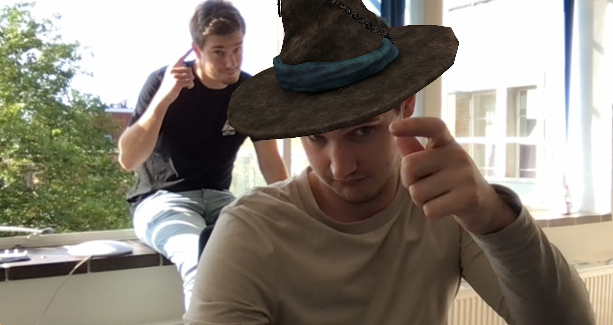
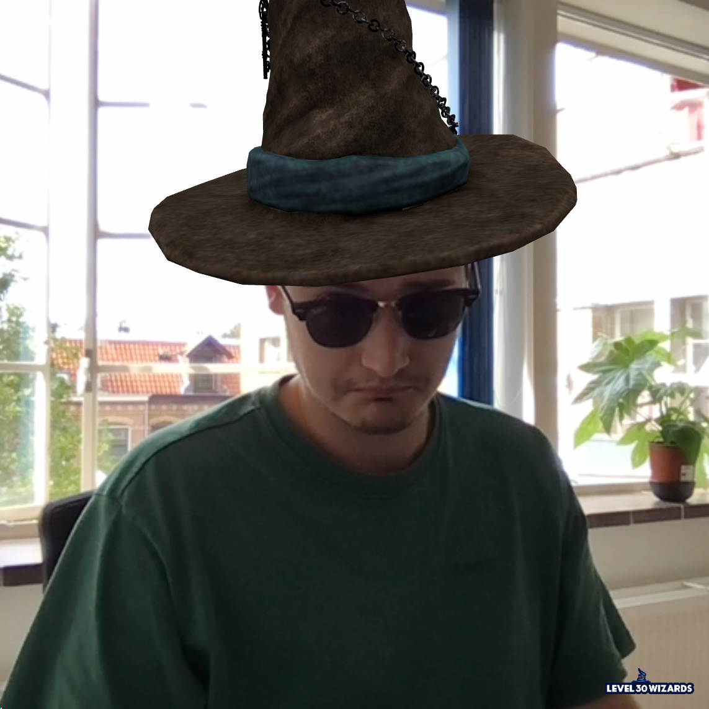

import { ToC } from '../../src/components/BlogPost/ToC';
import { CodeSandbox } from '../../src/components/codesandbox';

<ToC mdx={props.mdx} slugger={props.slugger} />

For the 3 year anniversary of [🧙🏼‍♂️ Level30Wizards](https://level30wizards.com/) we wanted to build something that's related to our work, brand and interests.
We finally ended up creating a Snapchat like facefilter for Web AR or Web XR.

You can try the final product here:
[Facefilter demo](https://level30wizards.com/experiments/facefilter/)

## Shameless plug

> Hey, are you looking to build a Facefilter for a client or project?
> We'd love to help.

[Send an email!](mailto:merlin@level30wizards.com)

## Intro

Mobile web browsing is advancing fast. We are able to get data from the NFC reader, Storage and also camera.
Sadly, as of now, we are not allowed to use the ARKit on iPhones or iPads.

There are a lot of great libraries like 8th Wall or Zappar, but they usually cost a pretty penny.  
Luckily, lots of smart people build neural networks that can recognize faces from 2D screens.

WebAR allows you to utilize computer or data visualization without the need of downloading an app, besides your default web browser.
Web AR can use both SLAM (Simultaneous Localization and Mapping) and Image Recognition technologies to digitally visualize your content. Since it's still a webpage, we can add a variety of web features and functionality to the AR experience. This opens up loads of opportunities on the web.

Augmented reality will be a valuable addition to a lot of existing web pages. For example, it could help people learn on education sites, or allow potential buyers to visualize objects in their home while shopping.

## Goal

The goal is to project a 3D model on top of our face.



## Tools

- [GSAP](https://greensock.com?ref=68708)
- [Three.js](https://threejs.org/)
- [React Three Fiber](https://docs.pmnd.rs/react-three-fiber/getting-started/introduction)
- [Jeeliz](https://jeeliz.com/)

## Prototyping disclaimer

This experiment we built, is a complete prototype.
We do _not_ recommend you use this in a production environment.
This example needs a lot of tweaks before it's viable to use in production.

## Code: Introduction

Before we show the camera, we need some time to load the 3D model and calculate some positions.
That's why we opted for an introduction screen that add some suspense.

> The pretty wavy text is from a previous tutorial! [Wavy Text Animation using React Hooks with GSAP v3
> ](/blog/wavy-text-animation-using-react-hooks-with-gsap-v3/)

```jsx
import gsap from 'gsap';
import React, { useEffect } from 'react';

export const Intro = () => {
  useEffect(() => {
    gsap.set('.wavy', { perspective: 400 });

    const sequence = (id, reverse) => {
      const tl = gsap.timeline({ delay: 0.5 });

      tl.from(`.wavy[data-id="${id}"]`, {
        duration: 0.5,
        autoAlpha: 0,
        ease: 'back',
        stagger: 1,
      })
        .from(`.wavy[data-id="${id}"] [data-letter]`, {
          duration: 0.5,
          autoAlpha: 0,
          scale: 1,
          y: -30,
          rotationX: -90,
          transformOrigin: '0% 50% -50',
          ease: 'back',
          stagger: 0.025,
        })
        .to(`.wavy[data-id="${id}"] [data-letter]`, {
          duration: 0.5,
          delay: 1.25,
          autoAlpha: 0,
          scale: 1,
          y: -30,
          rotationX: -90,
          transformOrigin: '0% 50% -50',
          ease: 'back',
          stagger: 0.025,
        })
        .to(`.wavy[data-id="${id}"]`, {
          duration: 0.25,
          autoAlpha: 0,
          ease: 'back',
          stagger: 1,
        });

      return tl;
    };

    const tl = gsap.timeline();

    tl.add(sequence('one'))
      .add(sequence('two'))
      .add(sequence('three'))
      .to('.intro', {
        duration: 1,
        autoAlpha: 0,
      });

    tl.timeScale(1.2);

    tl.play();
    return () => {
      tl.kill();
    };
  }, []);

  return (
    <div className="intro">
      <AnimatedText id="one" text={'Level30Wizards Presents...'} />
      <AnimatedText id="two" text={'Are you a true wizard?'} />
      <AnimatedText id="three" text={"Let's find out!"} />
      
      <a href="https://level30wizards.com" aria-label="level30wizards">
        
      </a>
    </div>
  );
};
```

## Wizards hat

To load in a 3D model, we used [GLTFJSX](https://www.npmjs.com/package/gltfjsx).

```
npx gltfjsx model.gltf -t
```

This results in this:

```jsx
// @ts-nocheck
/*
Auto-generated by: https://github.com/pmndrs/gltfjsx
author: Paulina (https://sketchfab.com/Byakko)
license: CC-BY-NC-4.0 (http://creativecommons.org/licenses/by-nc/4.0/)
source: https://sketchfab.com/3d-models/wizards-hat-68a9fb2dbd8442a5bacf9c0141320308
title: Wizard's hat
*/

import { useGLTF } from '@react-three/drei';
import React, { useRef } from 'react';

export default function Model(props) {
  const group = useRef();
  const { nodes, materials } = useGLTF('/models/wizards_hat/scene.gltf');
  return (
    <group ref={group} {...props} dispose={null}>
      <group rotation={[-Math.PI / 2, 0, 0]}>
        <group rotation={[Math.PI / 2, 0, 0]}>
          <mesh
            geometry={nodes.defaultMaterial.geometry}
            material={nodes.defaultMaterial.material}
          />
          <mesh
            geometry={nodes.defaultMaterial_1.geometry}
            material={nodes.defaultMaterial_1.material}
          />
          <mesh
            geometry={nodes.defaultMaterial_2.geometry}
            material={nodes.defaultMaterial_2.material}
          />
          <mesh
            geometry={nodes.defaultMaterial_3.geometry}
            material={nodes.defaultMaterial_3.material}
          />
          <mesh
            geometry={nodes.defaultMaterial_4.geometry}
            material={nodes.defaultMaterial_4.material}
          />
          <mesh
            geometry={nodes.defaultMaterial_5.geometry}
            material={nodes.defaultMaterial_5.material}
          />
        </group>
      </group>
    </group>
  );
}

useGLTF.preload('/models/wizards_hat/scene.gltf');
```

## Web AR Library

We used [Jeeliz R3F Demo](https://github.com/jeeliz/jeelizFaceFilter/tree/master/reactThreeFiberDemo) and combined that with some logic from their [Matrix Demo](https://github.com/jeeliz/jeelizFaceFilter/tree/master/demos/threejs/matrix).
If you want to, without any shame, copy paste this blogpost to create a working product... You're out of luck. Refer to the demos and tinker yourself, you'll probably learn more.

The resulting code that did most of the work looked a bit like this:

```jsx
const FaceFollower = props => {
  const objRef = useRef();
  useEffect(() => {
    const threeObject3D = objRef.current;
    _faceFollowers[props.faceIndex] = threeObject3D;
  });

  return (
    <object3D ref={objRef}>
      <Suspense fallback={null}>
        <WizardsHat
          rotation={[0, -Math.PI, 0]}
          position={[0, 1.825, 0]}
          scale={[1.5, 1.5, 1.5]}
          renderOrder={2}
        />
        <Head position={[0, -0.1435, 0]} scale={[1.125, 1, 1.125]} />
      </Suspense>
    </object3D>
  );
};
```

We used a model of a human's head and used a trick with `colorWrite` and `renderOrder`.
We just used some human head from SketchFab, low-poly is fine.

```jsx
const hiderMat = new THREE.MeshPhongMaterial({
  attach: 'material',
  color: 'hotpink',
  colorWrite: false,
  renderOrder: 1,
});
```

If we didn't do this, the hat would clip your face when you throw your head back in laughter, because the web ar experience is so _amazing_.

## Snapshot!

It wouldn't be a facefilter if you couldn't take a photo while making a peace-sign and touting your lips like a duck.

For our next trick, I used 3 canvas elements. Yes, we know.

We combine the camera canvas, the canvas containing the "hat" and "head" and the canvas on which we project our logo.

```jsx
const faceFilterCanvasRef = useRef(null);
const canvasRef = useRef(null);
const pictureCanvasRef = useRef(null);
const logoCanvasRef = useRef(null);

const snapshot = useCallback(() => {
  const canvas = pictureCanvasRef.current;
  canvas.getContext('2d').drawImage(faceFilterCanvasRef.current, 0, 0);

  const img = new Image();
  img.src = '/images/logo.png';

  img.addEventListener('error', e => {
    console.error(e);
  });
  img.addEventListener('load', e => {
    logoCanvasRef.current
      .getContext('2d')
      .drawImage(
        img,
        sizing.width - (144 + 24),
        sizing.height - (42.38 + 24),
        144,
        42.38
      );

    mergeImages([
      canvas.toDataURL('image/png'),
      canvasRef.current.toDataURL('image/png'),
      logoCanvasRef.current.toDataURL('image/png'),
    ]).then(b64 => {
      setDownloadUrl(b64);
      setShareData(b64);
    });
  });
}, []);
```

## Showing the final image

To download and share your photo, we tried to implement the Native Share API. But, that API required us to save the images, which we didn't like since that's a privacy concern.
Please take that into consideration if you build this yourself. Use a token or some way to verify the user looking at the image is from a shared link or the current user.

```jsx
<div
  style={{
    display: shareData ? 'block' : 'none',
    position: 'fixed',
    zIndex: 3,
    borderRadius: '50%',
    overflow: 'hidden',
  }}
>
  
</div>
```

That's all thanks.


### PS.

[See an example in action!](https://level30wizards.com/experiments/facefilter).  
We're working on some magical things at [🧙🏼‍♂️ Level30Wizards](https://level30wizards.com/), be sure to follow us on socials to keep an eye out for new releases.

---

### Thanks for reading!

We hope you've learned something about augmented reality in web browsers from this article.  
If you use this tech, please do so responsibly.
