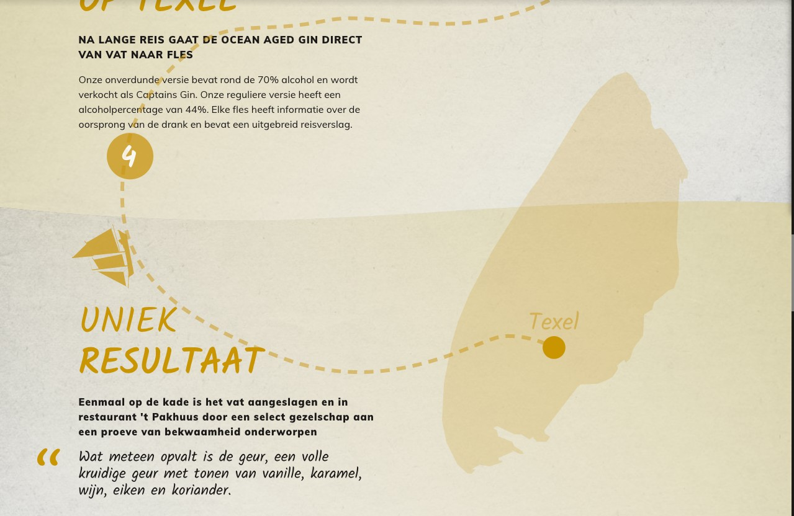
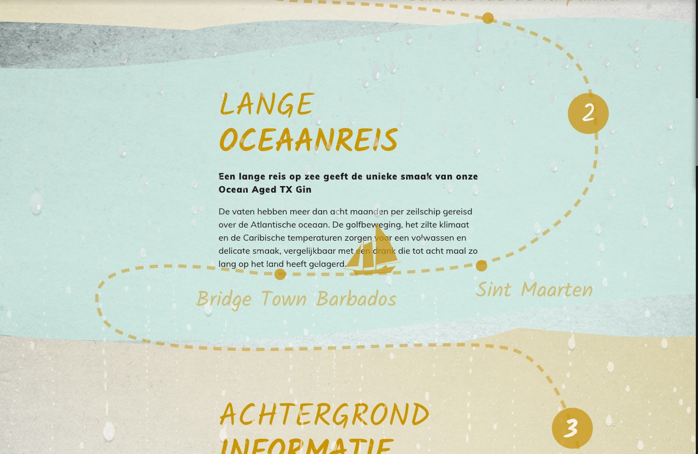
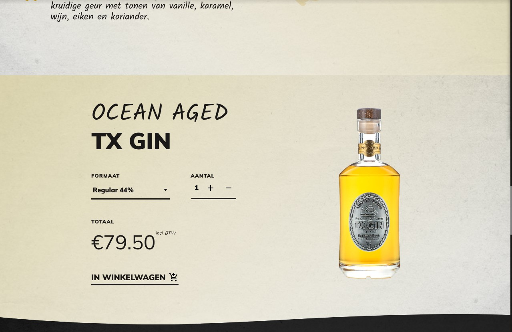

import { ToC } from '../../src/templates/blog.js';
import { CodeSandbox } from '../../src/components/codesandbox';

<ToC mdx={props.mdx} slugger={props.slugger} />

> “Good animation is invisible. You shouldn’t notice that you’re looking at animation. You want to make sure the timing and easing of your animation is right. In real life, things never show up and stop abruptly. When you stop a car, you go slower and slower then stop. The same thing should happen on the screen.” - Steven Fabre

In this article I'll break down how we created a motion styleguide for a customer and how we combined motion design, web animation and storytelling with e-commerce.

The final webpage is written in Dutch, excuse us for that.

## Goal

The goal of this project was to sell the story, so people want to buy the product.



## Story

Our client, [Stokerij Texel](https://stokerijtexel.nl/dranken/ocean-aged-tx-gin) a distillery located on the Dutch island Texel, sells uniquely distilled products.
For example they distill a Gin with locally resourced grain, berries and herbs.

A few times a year, a batch of this Gin gets aged on refurbished Oak wine barrels. They take these barrels of Gin and load them aboard a ship which then sails the ocean for 8 weeks.
The Gin gets infused with the flavors of the barrel and the ocean. This process is accelerated when the barrels are rocked by the waves.

It's a story that sells itself. But it needs a platform to be told on.

## Motion styleguide

A motion styleguide for a website should consist of a few key things:

- Message
- Conflict
- Character
- Action

And more technical:

- Consistant Easings
- Durations in certain situations
- What to do on reduced motion

### Message

The message we want to portray to a user is how much love, thought and effort go into one of the bottles of Ocean Aged Gin.
The brand is focussed around bottled liquids, which translate to liquid flowing and ultimately stopping inside of a container. It moves in a elastic or springy like way, since it involves real physics.

### Conflict

The conflict in this case was that the regular Gin, even though being great, tells almost the same story as a different locally sourced Gin.
The problem to be solved was to create a new type of Gin that blows your mind and is unique in many ways.
The conflict in the story we are telling on the page is that the ship that carries the caskets deals with the many hardships (get it? haha) of the ocean. That's why, [we made it rain](https://stokerijtexel.nl/dranken/ocean-aged-tx-gin).



### Character

Immersion.

> The feeling of a deep mental involvement.

This happens when you read a good book and you actually portray yourself as the main character.
We need the reader to feel that they want to be there, in the moment, _as_ or _with_ your product.

### Action

Since we're dealing with e-commerce in this case, we want to show the reader that they can experience the story through more than one sense.
We need to make them curious enough to want to taste, smell and experience the product.
The action is ofcourse that the reader can buy the product.



## Technical Motion Styleguide

[click here to skip the developer rambling](/#animated-storytelling-sells)

In the technical Motion Styleguide we write about easings, transitions and how we go about them.
We won't be writing about how we want someone to feel when interaction with a certain animation, but the technical and emotional side are very much connected.

### Consistant easings

We always like to find some fitting custom `cubic-bezier` easings to go with the design.
These easings can be passed from design to development or done directly in the code.

We wrote these with CSS variables:

```css
:root {
  --elasticTransition: cubic-bezier(0.31, -0.35, 0.7, 1.4);
}
```

We chose for an elastic (or springy) like animation because that resembles the movement of water. It eases in quite fast, overshoots a little (think water hitting a shore) and slows down into relaxation.

### Durations in certain situations

```css
:root {
  --elasticTransition: cubic-bezier(0.31, -0.35, 0.7, 1.4);

  --100ms: 150ms;
  --150ms: 150ms;
  --200ms: 200ms;
  --300ms: 300ms;
  --400ms: 400ms;
  @media (min-width: 48rem) {
    --100ms: 200ms;
    --150ms: 250ms;
    --200ms: 300ms;
    --300ms: 400ms;
    --400ms: 500ms;
  }
}
```

We increase the duration of some of the transitions. We do that because the distance something travels is longer (usually) on a desktop like device than on a mobile phone.
More information about common best practices we apply are found in this [article by Taras Skytskyi](https://uxdesign.cc/the-ultimate-guide-to-proper-use-of-animation-in-ux-10bd98614fa9)

### What to do on reduced motion

Some people get motion sickness, which is a very serious concern when creating web animations.
You want the product to stay accessible when someone disables all animation.

In JavaScript it is very easy to check if someone doesn't want animated content.

```js
const motionQuery = matchMedia('(prefers-reduced-motion: reduced)');
if (motionQuery.matches) gsap.set(tl, { timeScale: 99999999 });
```

In these two lines, we made every animation powered by [GSAP](https://greensock.com?ref=68708) instant.
This keeps your product intact (mostly, please test it anyways) and creates a pleasant experience for people who suffer from motion sickness.

## Animated storytelling, sells.

When you combine the emotional and technical aspects into a functional design that portrays the story your product tells, it may lead to an increase in sales.

We noticed that the animated story did in fact increase the engagement of users with the e-commerce product.
Since the brand also gained more fans, we can't do a precise calculation of how much our solution increased sales; but we estimate it to have sold at least 35% more products than a static page.

## The golden formula

There is no golden formula. You have to have a great story to sell, a good design, a motion design that captures the essence of the brand and has the ability to go beyond the expectations of the client.

Don't be afraid to show experimental animations or ideas to a corporate client, it will only show your interest in their brand if you sell your story in a professional way.

## A new standard

We preach to include Motion Design into every website. We always find a place for Motion Design in our products and use Motion as a way to communicate to, and guide, the user.

Many companies only create Visual Design styleguides and Lo-Fi paper prototypes, and many see animation as an aftermath.

By including Motion into the design at the beginning of a project, it will result in a website that communicates in typographic hierarchy combined with guidance by motion.

### PS.

[See an example in action!](https://stokerijtexel.nl/dranken/ocean-aged-tx-gin)
We're working on some cool sh\*t at [🧙🏼‍♂️ Level30Wizards](http://level30wizards.com/), be sure to follow us on socials to keep an eye out for new releases.

---

### Thanks for reading!

We love that the web gets more animated every day. The only thing we need to look out for is that we keep it accessbile for everyone, and we don't use our qualities for corporate dark patterns.
