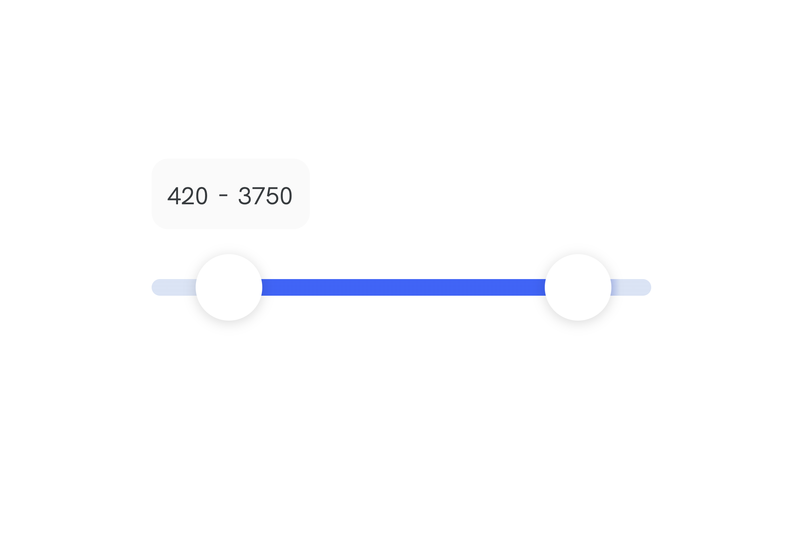

import { ToC } from '../../src/templates/blog.js';

<ToC mdx={props.mdx} slugger={props.slugger} />

## Tech stack

This component was built while working at [Level30Wizards](https://Level30Wizards.com), the Tech Stack we used to achieve this is:

- [React](https://reactjs.org/) for markup, templating, routing, etc.
- [Framer Motion](https://www.framer.com/motion/) for animation
- [EmotionCSS](https://emotion.sh/docs/introduction) to write normal CSS, nest selectors and componentize styles

## Goal

We want to create a slider with two thumbs that allow us to pick a range between two values.
The slider should add the values to hidden inputs for easy access when submitting forms.

## Markup

```jsx
<div>
  // The are the inputs that will capture the values of the slider.
  <input
    type="hidden"
    name={'price-min'}
    value={(max / (trackWidthInPx / knobX)).toFixed(0)}
  />
  <input
    type="hidden"
    name={'price-max'}
    value={(max / (trackWidthInPx / knobXSecond)).toFixed(0)}
  />
  // A title or label
  <p
    style={{
      textAlign: 'left',
      fontWeight: 'bold',
      margin: '.5rem 0',
    }}
  >
    {label}
  </p>
  // These are small amount labels that show the selected value of both thumbs.
  <AmountLabels>
    <small
      style={{
        marginBottom: '0.25rem',
        marginRight: '0.25rem',
      }}
    >
      {/* If knobX isnt 0 or lower we set the textvalue on the track */}
      {knobX > 0
        ? Math.ceil(
            parseInt((max / (trackWidthInPx / knobX)).toFixed(0), 10) / 5
          ) * 5
        : t('filters.priceRange.noMin')}
    </small>
    {'-'}
    <small
      style={{
        marginLeft: '0.25rem',
        marginBottom: '0.25rem',
      }}
    >
      {/* We set the text value for knobXSecond */}
      {Math.ceil(
        parseInt((max / (trackWidthInPx / knobXSecond)).toFixed(0), 10) / 5
      ) * 5}
    </small>
  </AmountLabels>
  // This is the "rail/track" where the thumbs will slide on.
  <motion.div css={Track} ref={constraintsRef}>
    // The first thumb (or knob)
    <motion.div
      css={Knob}
      drag="x"
      initial={{
        x: knobX,
      }}
      dragMomentum={false}
      // When you stop dragging we update the AmountLabel value
      onDragEnd={() => {
        const minPrice = Number(getValueOfKnob(knobX));
        setSliderMin(minPrice);
      }}
      // While you're dragging we update the knobX state
      onDrag={(event, info) => {
        // Check if the point where you slide is bigger than second knob...
        // knobSeparatorLength is a magic value for 2rem size of the knobs. This will influence the bounds of the knobs
        const newValue =
          info.point.x > knobXSecond - knobSeparatorLength
            ? knobXSecond - knobSeparatorLength
            : info.point.x;
        //Math.ceil(N / 5) * 5; rounds to nearest 5
        updateKnobX(newValue < 0 ? 0 : Math.ceil(newValue / 5) * 5);
      }}
      // Cant be dragged further than...
      dragConstraints={{
        left: 0,
        right: knobXSecond - knobSeparatorLength,
      }}
    />
    // The second thumb (or knob)
    <motion.div
      css={Knob}
      drag="x"
      initial={{
        x: knobXSecond,
      }}
      dragMomentum={false}
      onDragEnd={() => {
        const maxPrice = Number(getValueOfKnob(knobXSecond));
        setSliderMax(maxPrice);
      }}
      onDrag={(event, info) => {
        // Check if the point where you slide isn't smaller than first knob and not bigger than bounds...
        const newValue =
          info.point.x > trackWidthInPx
            ? trackWidthInPx
            : info.point.x < knobX + knobSeparatorLength
            ? knobX + knobSeparatorLength
            : info.point.x;
        updateKnobXSecond(Math.ceil(newValue / 5) * 5);
      }}
      dragConstraints={{
        left: knobX + knobSeparatorLength,
        right: trackWidthInPx,
      }}
    />
  </motion.div>
</div>
```

## CSS

When you use `EmotionCSS`, you can use props to determine styling.
An example of this can see seen in the CSS block of the `Track`. There we calculate a `linear-gradient` based on the position of the thumbs.

```jsx
const Knob = css`
  width: ${knobSize}rem;
  height: ${knobSize}rem;
  border-radius: 50%;
  background-color: ${theme.colors.white};
  top: calc(-50% - 0.5rem);
  position: absolute;
  box-shadow: 0 1px 6px 0 rgba(0, 0, 0, 0.15);
  cursor: pointer;

  &:nth-of-type(2) {
    left: -2rem;
  }
`;

const Track = css`
  width: ${trackWidth}rem;
  height: 0.5rem;
  background-color: ${theme.colors.blue};
  // This gradient contains a calculation for the slider track.
  background: linear-gradient(
    to right,
    ${theme.colors.lightBlue} 0%,
    ${theme.colors.lightBlue} ${Number(
        (100 * (knobX / trackWidthInPx)).toFixed(2)
      )}%,
    ${theme.colors.blue} ${Number(100 * (knobX / trackWidthInPx) + 8).toFixed(2)}%,
    ${theme.colors.blue} ${Number(
        (100 * (knobXSecond / trackWidthInPx)).toFixed(2)
      ) -
      8 -
      0.01}%,
    ${theme.colors.lightBlue} ${Number(
        100 * (knobXSecond / trackWidthInPx)
      ).toFixed(2)}%
  );
  border-radius: 0.25rem;
  position: relative;
  margin: 1rem 0 2rem;
`;

const Row = styled.div`
  display: flex;
  align-items: baseline;
  margin: 1rem 0 1.5rem;
  position: relative;
`;

const AmountLabels = styled.div`
  font-size: 0.875rem;
  background-color: ${theme.colors.greyTags};
  border-radius: 0.5rem;
  padding: 0.5rem;
  display: inline-block;
  margin-bottom: 0.5rem;
`;
```

## Using hooks

I used hooks to keep a state, update values and set references to certain elements/components.
We also like to use TypeScript to keep things readable.

```jsx
// SliderParent.tsx
const SliderParentComponent = () => {
  const [sliderMin, setSliderMin] = useState(personalDetails.minBudget);
  const [sliderMax, setSliderMax] = useState(personalDetails.maxBudget);

  return (
    <Slider
      defaultMinBudget={personalDetails.minBudget}
      defaultMaxBudget={personalDetails.maxBudget}
      label={t('common:Core.whatIsYourMonthlyBudget')}
      max={4000}
      t={t}
      setSliderMin={setSliderMin}
      setSliderMax={setSliderMax}
    />
  );
};

//Slider.tsx
interface Props {
  max: number; //ex. 4000
  defaultMinValue?: number; // If there is a value already, we use this as placeholder
  defaultMaxValue?: number;
  t: TFunction; // Our translation library for multi language (next18next)
  label?: string; //Text value of the label
  setSliderMin: (value: number) => void; // This is a state
  setSliderMax: (value: number) => void;
}

export const Slider: React.FC<Props> = props => {
  const {
    label,
    max,
    t,
    setSliderMin,
    setSliderMax,
    defaultMinValue,
    defaultMaxValue,
  } = props;
  // We use trackLength to increase the length of the slider.
  const trackLength = 10;
  // `trackWidth` is the final width of the slider.
  const trackWidth = 1.5 * trackLength;
  // We use `rem` as our size values so we need to multiple the width by 16 (1rem = 16px)
  const trackWidthInPx = trackWidth * 16; //192
  // This is a scale to increase the size of the Knobs/Thumbs
  const knobSize = 2;
  const knobSizeInPx = knobSize * 16;
  // This is the amount of range we want to keep between two thumbs/knobs to avoid them stacking
  const knobSeparatorLength = knobSizeInPx * 2.25;

  // max is a number value (ex. 4000)
  function getPixelValue(knob) {
    return (knob / max) * trackWidthInPx;
  }

  // We calculate the value of the knob on the track. We like to increment in steps of 5
  function getValueOfKnob(knob) {
    const value: number = parseInt(
      (max / (trackWidthInPx / knob)).toFixed(0),
      10
    );
    return Math.ceil(value / 5) * 5;
  }

  // This is the first knobs value and position on the track.
  const [knobX, updateKnobX] = useState(
    defaultMinValue ? getPixelValue(defaultMinValue) : 0
  );
  const [knobXSecond, updateKnobXSecond] = useState(
    defaultMaxValue ? getPixelValue(defaultMaxValue) : trackWidthInPx
  );
  // A constraintsRef to use set on the track and disallow the knobs to move further than the knob
  const constraintsRef = useRef(null);

  // STYLING COMPONENTS HERE

  // HTML/MARKUP HERE
};
```



### Final words

That's it!
This component can for example allow a user to set their budget on an e-commerce website.
We gave the default values and final value state via `useState` hook as a prop, so we are able to use the value from the slider in it's parent.

---

### Thanks for reading!

I hope someone somewhere learned something via this post! If you did, please consider sharing the article.
