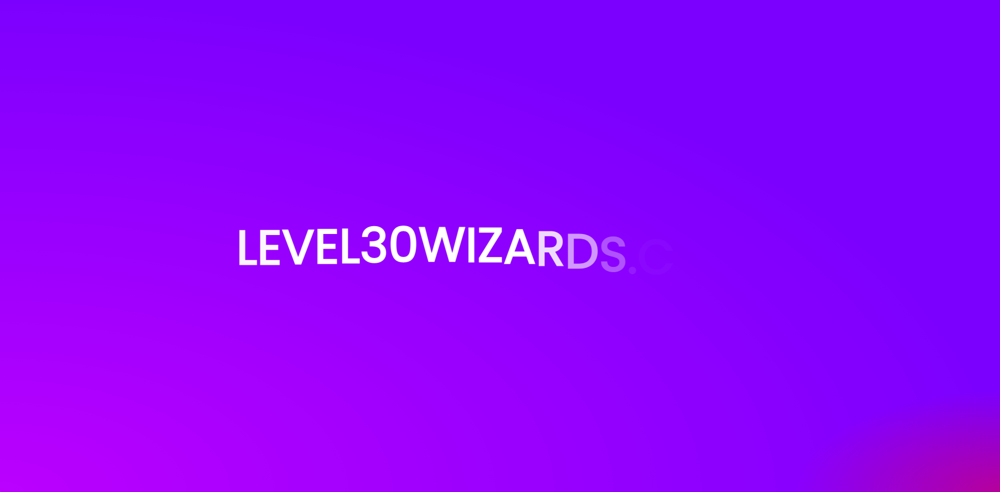

import { ToC } from '../../src/components/BlogPost/ToC';
import { CodeSandbox } from '../../src/components/codesandbox';

<ToC mdx={props.mdx} slugger={props.slugger} />

In this article i'll recreate a wavy text animation we built with `React Hooks` and `GSAP v3` but with `Framer Motion`.  
If you would like to see the `GSAP` tutorial, check it out [here](/blog/wavy-text-animation-using-react-hooks-with-gsap-v3/).

For the example I created my own small text split function. This example should be usable in React frameworks like Gatsby, Next.js, etc.



## Tech stack

- [React](https://reactjs.org/) for markup, templating, routing, etc.
- [Framer Motion](https://www.framer.com/api/motion/) for animation
- [EmotionCSS](https://emotion.sh/docs/introduction) to write normal CSS, nest selectors and componentize styles

## Goal

We want to create text that animates on first-load. The text should be split for each letter, then animate once smoothly.

## CSS

We create some global CSS:

```css
/* @import for demo purposes. Don't use it in prod as its bad for performance */
@import url('https://fonts.googleapis.com/css2?family=Poppins&display=swap');

body {
  margin: 0;
  background: #7700ff;
}

.App {
  font-family: poppins;
  text-align: center;
  background: radial-gradient(
      farthest-side at bottom left,
      rgba(255, 0, 255, 0.5),
      transparent
    ), radial-gradient(farthest-corner at bottom right, rgba(255, 50, 50, 0.5), transparent
        400px);

  position: relative;

  width: 100%;
  min-height: 100vh;

  margin: 0;
  padding: 0;

  display: flex;
  justify-content: center;
  align-items: center;
}
```

And we make the text look pretty with some css. The `font-size` value is based on a `clamp` function used in WebGL.
The function creates a range between `1600px` and `320px` screenwidth. Within this range it calculates a `font-size` between `80px` and `32px`.  
The `motion.h2` means that we use the `motion` component from `Framer Motion` and tell it to use the `h2` HTML element.

```jsx
const StyledTitleElement = styled(motion.h2)`
  font-size: calc(32px + (80 - 32) * ((100vw - 320px) / (1600 - 320)));
  line-height: calc(32px + (80 - 32) * ((100vw - 320px) / (1600 - 320)));

  font-family: poppins;
  text-transform: uppercase;

  position: relative;
  display: inline-block;
  max-width: 100%;

  word-break: break-word;
  z-index: 10;

  color: white;
`;
```

## Using hooks and writing markup

I'm using a timeout that updates a state `inView`. When `inView` updates it triggers the `useEffect` hook and replays the animation, resulting in a loop.

```jsx
export default function App() {
  // You can toggle this with intersection observer.
  const [inView, updateInView] = useState(false);

  // Don't do this in production :)
  useEffect(() => {
    let timeout = setTimeout(() => {
      updateInView(!inView);
    }, 2000);

    return () => clearTimeout(timeout);
  }, [inView]);

  return (
    <main className="App">
      <AnimatedTitle currentInView={inView}>level30wizards.com</AnimatedTitle>
    </main>
  );
}
```

## Animating with Framer Motion

To start animating with Framer Motion, we need to understand some jargon.  
Framer Motion uses `variants` to distinguish between the `initial` state, the `animate` state and the `exit` state.  
It looks like this:

```jsx
<StyledTitleElement
  {...props}
  variants={letterContainerVariants}
  initial={"before"}
  animate={"after"}
  exit={"before"}
  key={children}
  aria-label={children} // people with assistive tech don't feel like hearing individual letters ;)
  //aria-live="polite" add this if you dynamically show the element
>
```

> Framer Motion uses `variants` to distinguish between the `initial` state, the `animate` state and the `exit` state.

## Variants

Variants are pretty much just JavaScript objects that contain information for the animation.  
The `letterContainerVariants` are set on the parent element that contains all the individual letters.  
The `letterVariants` are set on, you guessed it, the individual letters.

```js
// Add staggering effect to the children of the container
export const letterContainerVariants = {
  before: { transition: { staggerChildren: 0.015 } }, // When the letters show they stagger with a duration of 0.015 seconds
  after: { transition: { staggerChildren: 0.03 } }, // When the letters hide they stagger with a duration of 0.03 seconds
};

// Variants for animating each letter
export const letterVariants = {
  // before state or initial
  before: {
    opacity: 0, // invisible!
    y: 20, // a bit lower than final position
    transition: {
      type: 'spring', //physical spring transition
      damping: 12, //how quickly the spring slows down
      stiffness: 200, // how "stiff" the spring is
    },
  },
  // after state or exit
  after: {
    opacity: 1,
    y: 0,
    transition: {
      type: 'spring',
      damping: 12,
      stiffness: 200,
    },
  },
};
```

## Splitting words in React

```tsx
{
  {
    /* split sentences into words */
  }
  children.split(' ').map((word: string, wordI: number) => (
    <div
      key={`word-${word}-${wordI}`}
      style={{
        display: 'inline-block',
      }}
    >
      {/* split words into letters */}
      {Array.from(word).map((letter, index) => (
        <motion.span // we need motion because we will add a Framer Motion animation variant to it.
          key={`${index}-${letter}`}
          style={{
            position: 'relative',
            display: 'inline-block',
            width: 'auto',
          }}
          variants={letterVariants} // variant for the individual letter
        >
          {/* letter or space */}
          {letter === ' ' ? '\u00A0' : letter}
        </motion.span>
      ))}
      {'\u00A0'}
    </div>
  ));
}
```

## Demo

You can check out the demo here:

<CodeSandbox id={'00ltz'} view="editor" />

### Final words

That's it!  
You can link this animation to an `Intersection Observer` to animate while scrolling, or keep it like this to animate when someone navigates.  
If you want to see it in production, visit: [Level30Wizards](https://level30wizards.com?utm_source=webanimationblog)

---

### Thanks for reading!

I hope someone somewhere learned something via this post! If you did, please consider sharing the article.
